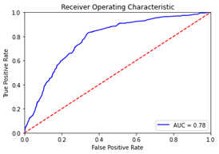
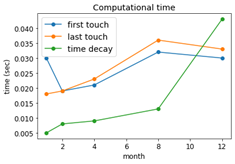
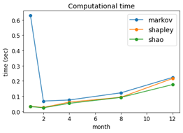
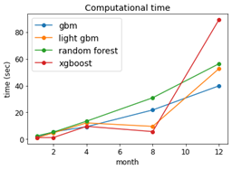

# ModelComparison-for-MTA

## Цель проекта:

Cравнение различных методов и алгоритмов атрибуции, оценка точности рассмотренных алгоритмов по показателю ROC AUC и выявление наиболее эффективных и практически применимых моделей на основе пользовательского набора данных.

## Задачи:

- Создание и обучение моделей машинного обучения
- Выполнение проверки точности классификации, используя показатель площадь под ROC-кривой (AUC), визуализация графика.
- Сравнительный анализ времени работы всех рассмотренных алгоритмов
- Визуализация полученных результатов расчета физического времени работы эвристических, алгоритмических моделей атрибуции и моделей машинного обучения в виде графиков

## Результаты

На основе подготовленного набора данных в [**DataPrep-for-MTA**](https://github.com/devandre/DataPrep-for-MTA), в **attribution_comparison.ipynb** и **ensemble.ipynb** была проведена комплексная оценка точности алгоритмов атрибуции по показателю ROC AUC.
Сравнивая показания классификатора с фактически известными данными, можно делать вывод о точности классификатора.
- Для начала была создана и обучена модель градиентного бустинга, произведена оценка сложности, подсчитано время работы данного алгоритма.
- После процесса обучения, была выполнена проверка точности классификации, используя площадь под ROC-кривой (AUC) и построен график.

Для комплексной оценки производительности указанных алгоритмов и сравнения времени работы указанных алгоритмов с данными по точкам касания клиентов и маркетинговых каналов, аналогичным образом было проведено обучение следующих алгоритмов 
- Random forest
- GBM
- LightGBM
- XGBoost 

на наборах данных, содержащих сведения за **1**, **2**, **4**, **8**, **12 месяцев**.

Результаты расчета AUC после обучения каждого классификатора:
|   | Technique | Train_AUC | Valid_AUC |
|---|-----------|-----------|-----------|
| **0** | Random Forest | 0.755118 | 0.750259 |
| **1** | GBM | 0.749057 | 0.749828 |
| **2** | LightGBM | 0.745556 | 0.746999 |
| **3** | XGBoost | 0.730077 | 0.736472 |
| **4** | All | 0.757889 | 0.755560 |

### Cравнительный анализ времени работы всех рассмотренных алгоритмов

В **time_comparison.ipynb** показан сравнительный анализ времени работы всех рассмотренных алгоритмов, визуализация полученных результатов расчета физического времени работы эвристических, алгоритмических моделей атрибуции и моделей машинного обучения в виде графиков. Показана зависимость физического времени работы алгоритма (в секундах) по оси Y от количества данных (за 1, 2, 4, 8, 12 месяцев) в обрабатываемом наборе по оси X. 

Контрольное количество данных по оси X (за 1, 2, 4, 8, 12 месяцев) для сравнения на графиках обозначено метками.

### Сравнение времени работы эвристических моделей:

### Сравнение времени работы алгоритмических моделей:

### Сравнение времени работы моделей машинного обучения:

## Выводы
По итогу сравнительного анализа времени работы эвристических моделей было установлено, что разброс во времени работы моделей – незначителен, и зависит от количества данных. Сравнение времени работы алгоритмических моделей – показало, что разброс во времени работы разных алгоритмов – несущественный, зависит от количества данных. Было выявлено, что алгоритмические модели работают дольше, чем эвристические. Сравнение времени работы моделей машинного обучения – показало, что присутствует зависимость скорости обработки от количества данных и выявлено, что наиболее быстрым методом является – gbm с точностью 0,74 и xgboost - как самый медленный алгоритм с точностью 0,73 (за контрольное количество данных – 12 месяцев). 

Таким образом несмотря на небольшое количество времени работы как эвристических, так и алгоритмических моделей качество результатов, а также точность данных методов крайне мала, из-за невозможности подтвердить результаты анализа достоверным способом. Однако, качество моделей машинного обучения, можно проверить различными способами, в том числе методом вычисления площади под кривой ошибок, что дает основное преимущество при выборе модели многоканальной атрибуции.

